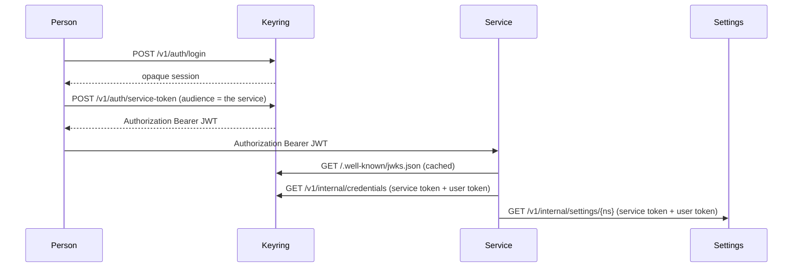
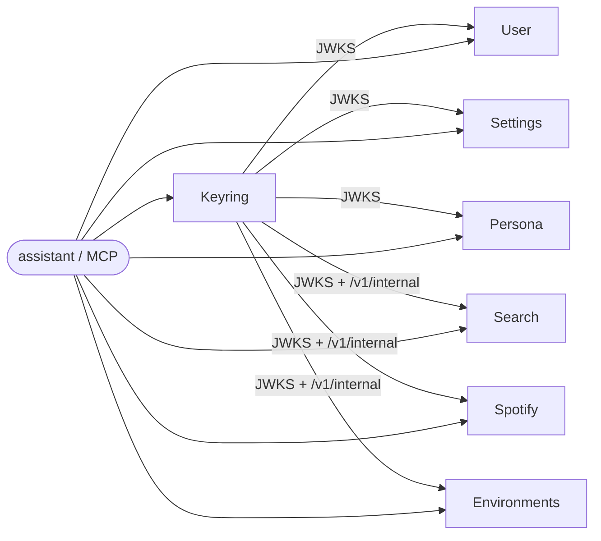

# LUCY-assistant

Lucy is the assistant hub in `src/lucy_api/`. This repository also holds the **family
desk**: tools and documentation for eight public sibling services, each in its own git
repository. `scripts/bootstrap.sh` clones those checkouts beside this file. An optional
local media service can be added through the `local` Compose profile.

The hub currently provides health, readiness, identity and a command-line setup flow.
Conversation sessions, the model loop, memory and agents are planned; installing the
client does not yet provide a chat command.

`make check` is the same four gates everywhere it exists: lint, types, imports, tests at
100% branch coverage. `python scripts/parity.py` is how we notice when a checkout has
drifted.

**The published family repositories are public by default.** Bootstrap clones every
service listed in `repos.txt` (plus optional gitignored `.repos.local.txt`) that your
account can read; public ones need no login. Sign in with `gh` when you need private
checkouts, forks, or write access. CI uses the shared family GitHub App over OIDC, not a
personal token.

## Services

| Service | Purpose | Port | Env prefix | Health |
| --- | --- | ---: | --- | --- |
| **Lucy** (this repository) | The assistant hub: health, readiness and caller identity; conversation support is in development. | 8000 | `LUCY_` | `/healthy`, `/ready` |
| [Keyring-api](https://github.com/tochi-mba/Keyring-api) | Accounts, profiles, and the credential vault. Issues the tokens everyone else verifies. | 8001 | `KEYRING_` | `/healthy`, `/ready` |
| [User-api](https://github.com/tochi-mba/User-api) | Structured facts about the **person** the assistant is talking to. | 8002 | `USER_API_` | `/healthy`, `/ready` |
| [Settings-api](https://github.com/tochi-mba/Settings-api) | Per-person knobs that used to live as process-wide env vars. | 8003 | `SETTINGS_API_` | `/healthy`, `/ready` |
| [Persona-api](https://github.com/tochi-mba/Persona-api) | The assistant's model of **itself** (fields and notes, one persona per profile). | 8004 | `PERSONA_` | `/healthy`, `/ready` |
| [Web-search-api](https://github.com/tochi-mba/Web-search-api) | Search, scrape, and summarise with a provider resolved per caller. | 8006 | `WSA_` | `/healthy` (alias `/health`), `/ready` |
| [Spotify-api](https://github.com/tochi-mba/Spotify-api) | Batch track lookup and confirmed playback. Holds no Spotify credential. | 8007 | `SPOTIFY_API_` | `/healthy`, `/ready` |
| [Environments-api](https://github.com/tochi-mba/Environments-api) | Sandboxed shells. Remote code execution as a product; needs Linux. | 8008 | `ENVAPI_` | `/healthy` (alias `/health`), `/ready` (alias `/health/ready`) |
| [Memory-api](https://github.com/tochi-mba/Memory-api) | What the assistant has learned about the person: provenance, history, and a topic index. | 8009 | `MEMORY_` | `/healthy`, `/ready` |

Every service listens on its assigned port, so the hub and its siblings run on one host
without a collision. Compose maps each host port to the same number inside the container.
Port 8005 is the optional local media service, which is not part of the published family.

**`/healthy` is liveness and `/ready` is readiness**, everywhere. Liveness does no I/O and
never fails, because an orchestrator restarts a container whose liveness check fails and
restarting a process does not fix the service it depends on. Readiness reports each
dependency and answers 503 when one is unusable. Point container healthchecks at the first
and load balancers at the second.

## Token flow

A person logs into keyring and holds an **opaque session**. Anything that acts for them
asks keyring to mint a short-lived **Bearer JWT** for a named audience, then presents
that token to the service. The service verifies it locally against keyring's JWKS. If it
needs a third-party credential, it calls keyring's `/v1/internal` with its own service
token *and* the user's token. If it needs a per-person knob, it calls settings-api the
same way.



Authorization is **Bearer**, everywhere. No `X-API-Key` as the identity of a person.
(A couple of services still accept an optional network-level API key on top; that is
not who the request is *for*.)

## Who calls whom



User-api, Persona-api, and Settings-api never call keyring at request time except to
fetch public keys. They have **no** entry in `KEYRING_SERVICE_TOKENS`. Spotify-api,
Web-search-api, and Environments-api do: they resolve credentials per request.
Settings grants exist for credential consumers so wiring a settings client is a
deployment choice, not a settings-api release.

Nothing in this family calls User, Persona, Search, Spotify, or Environments except
the assistant sitting in front.

## Your first hour

For the command-line client, install [uv](https://docs.astral.sh/uv/getting-started/installation/),
clone this repository, then run either installer. Its path can be absolute; your working
directory does not matter.

```bash
bash scripts/setup.sh
# PowerShell: pwsh scripts/setup.ps1
```

The installer puts `lucy` on your user PATH through `uv tool install --editable`, then
opens `lucy setup`. Choose **hub** for a local development hub, **family** for the local
Compose stack, or **remote** for an existing hub URL. Setup saves client configuration
and explains the remaining steps; it does not start services. Use `--dry-run` to preview
the installer or `--skip-setup` to install only. Keep this checkout in place because the
editable command imports its code from here.

```bash
lucy config                     # effective configuration, with the token redacted
lucy doctor                     # independent checks and fixes
lucy connect                    # discover capability setup support from your hub
```

Signing into Lucy currently means providing a Keyring-issued JWT with audience
`lucy-api`, using the hidden setup prompt, `LUCY_TOKEN`, or `--token-stdin`. Browser and
device sign-in are not implemented yet. You can skip the token and finish later.
[The CLI guide](docs/cli.md) covers remote setup, automation and diagnostics.

For family service development:

1. Open this folder in a [devcontainer](.devcontainer/devcontainer.json) or on
   Linux/macOS/WSL2. Native Windows without WSL2 can run most services; Environments-api
   cannot.
2. `bash scripts/bootstrap.sh` or `pwsh scripts/bootstrap.ps1`. That checks for `uv`,
   Python 3.12/3.13, `make`, `git`, `gh`, `jq`, `sqlite3`, reports Docker without
   installing it, asks you to sign in to GitHub (browser or a pasted token) if you are
   not already, clones any missing checkout your account can read from `repos.txt`, and runs
   `make install` unless you pass `--no-install`. The family GitHub App is only for CI;
   local development uses your own GitHub sign-in.
3. In Keyring-api: copy `.env.example`, set `KEYRING_MASTER_KEY`, `make run`.
4. Mint a service token for the service you are working on
   (`POST /v1/auth/service-token` with that service's audience) and put the Bearer on
   the request.
5. `make check` in that repository. `python scripts/parity.py` from here for the family
   scoreboard — it scores the hub too.

To work on **Lucy herself**, you are already in the right directory:

```bash
make install
make run                          # http://127.0.0.1:8000/docs
curl localhost:8000/healthy       # liveness: no I/O, never fails
curl localhost:8000/ready         # readiness: 503 until keyring is up, and it says so
make check                        # lint, types, imports, tests at 100% branch coverage
```

To run the whole family with Docker Engine running:

```bash
python scripts/genenv.py          # writes .env.family; never prints the values
make images && make up            # host ports 8000–8009; up reuses the build cache
```

Re-running `genenv.py` refuses to overwrite `.env.family` unless you pass `--force`.

## The `lucy` command

`lucy` manages client setup and checks a running hub from any directory. The installer
above puts it in its own isolated environment; inside this repository, `uv run lucy`
also works without a global installation.

```bash
lucy setup                          # choose hub, family, or remote; save client settings
lucy status                         # alive, ready, which dependency is down, and who you are
lucy status --json | jq .ready      # the same, as a contract a script can depend on
lucy serve                          # run the hub here, in the foreground
```

It is a **client**: the same command works against a hub on this laptop, in compose, or on
another machine. `--url` overrides `LUCY_URL`, which overrides the saved URL. Your token
comes from `LUCY_TOKEN` or the saved configuration and is never a flag value. Exit
codes are `0` worked, `1` the answer was no, `2` bad command, `3` hub unreachable.
[docs/cli.md](docs/cli.md) has the rest.

## Signing in to GitHub

```bash
gh auth status               # which account is active
gh auth login                # a browser window, or paste a token: gh asks which
bash scripts/bootstrap.sh    # signs you in if you skipped that, then clones
make images                  # local builds use the same sign-in
```

Bootstrap runs `gh auth login` when you are not signed in and a terminal is available,
then `gh auth setup-git`, so `git clone` and `uv`'s fetches of the client packages use
that account. A repository your account cannot see is reported and skipped; existing
checkouts are left alone. Without a terminal, set `GH_TOKEN`; the devcontainer forwards
yours and re-runs bootstrap when a terminal attaches.

CI cannot open a browser, so it uses the public **lucy-assistant family CI** app. That
app is **not** how a clone on your laptop authenticates: a laptop uses the `gh` login
above. `python scripts/connect_github.py` opens
<https://github.com/apps/lucy-assistant-family-ci>; you click **Install** on the family
repositories. Each CI job proves its identity with GitHub OIDC; the family broker then
mints a one-hour read-only token for that installation. Another developer who cloned
this repo and added their own API repositories runs the same command and installs
**the same app** on *their* repositories. They receive neither our app private key nor
a long-lived token. Never put a GitHub credential in `.env.family`, a Docker build
argument, an Actions secret, or a committed file.
[docs/private-repos.md](docs/private-repos.md) is the full walkthrough. On native Windows,
run Make recipes in Git Bash; bootstrap also has a PowerShell version.

## Adding a repository to the family

Start from [examples/hello-api](examples/hello-api) and follow
[docs/adding-a-service.md](docs/adding-a-service.md). Append one line to `repos.txt`
(public) or `.repos.local.txt` (gitignored, for private checkouts only):
`<folder> <https clone URL>`. Re-run bootstrap to clone it. For the family checks, give
the service this caller in `.github/workflows/ci.yml`:

```yaml
name: CI
on:
  push:
    branches: ["**"]
  pull_request:
  workflow_dispatch:
permissions:
  contents: read
  id-token: write
jobs:
  service:
    uses: tochi-mba/LUCY-assistant/.github/workflows/service.yml@v1
```

Add the new repository to the family app's installation (GitHub → Settings →
Applications → Installed GitHub Apps → the family app → Repository access) so CI can read
it, then `python scripts/parity.py --repo <folder>`. Bootstrap discovery needs only the
manifest line; adding a running service to Compose or a folder to the IDE workspace is a
separate choice.

## Keeping your copy private / Forking

Copy this repository and the siblings listed in `repos.txt` under one owner, keeping
their names and client tags.
GitHub forks inherit their network's visibility: a fork of a public repository cannot
be made private by itself. Use private standalone copies when the upstream is public,
or private forks when GitHub permits them. See [GitHub's fork rules](https://docs.github.com/en/pull-requests/reference/forks).

From your copy of this meta-repo, with the service checkouts present:

```bash
python scripts/retarget.py YOUR_OWNER --dry-run
python scripts/retarget.py YOUR_OWNER
# Run each printed `uv lock --directory ...` command, review and commit the lockfiles.
```

The script changes manifest clone URLs and tagged client source URLs. It preserves line
endings and never edits `uv.lock`, git remotes, or the canonical CI caller. Keeping
`tochi-mba/LUCY-assistant@v1` is deliberate: the broker trusts that public workflow's
OIDC identity. `--keep-sources` retains upstream client URLs when your account can still
read them; `--self-host-ci` is only for a deployment operating its own app and broker.
Relock on a machine signed in to the destination owner and push the resulting changes.

Sign in with `gh auth login` as the destination owner. Local `make run` / `make up` use
that login only. For CI, run `python scripts/connect_github.py` there: the browser opens
the **lucy-assistant family CI** Install page, you click Install on *your* repositories,
and the broker scopes each job's token to your installation. Your copy may remain
private; its callers continue using the canonical public workflow. The
[sign-in and rollout guide](docs/private-repos.md) has the order.

## Links

| | |
| --- | --- |
| Family standard | [CONTRIBUTING.md](CONTRIBUTING.md) |
| The `lucy` command | [docs/cli.md](docs/cli.md) |
| Architecture | [docs/architecture.md](docs/architecture.md) |
| How Lucy's context is built | [docs/context.md](docs/context.md) |
| Security | [docs/security.md](docs/security.md) |
| CI caller | [docs/ci.md](docs/ci.md) |
| GitHub sign-in and private copies | [docs/private-repos.md](docs/private-repos.md) |
| Adding a service | [docs/adding-a-service.md](docs/adding-a-service.md) |
| Example API | [examples/hello-api](examples/hello-api) |
| ADRs | [docs/adr/README.md](docs/adr/README.md) |
| Parity checker | `python scripts/parity.py` |
| Shared clients | `Keyring-api/clients/python`, `Settings-api/clients/python` |

## Support matrix

| Platform | Services | Compose | Notes |
| --- | --- | --- | --- |
| Linux | Hub and all public siblings | Expected to work | Environments-api sandbox tiers need privileges / `unshare`. |
| macOS | Hub and public siblings; Environments-api directory tier only | Expected to work | Namespace/user tiers are Linux. |
| Windows via WSL2 | Same as Linux | Expected to work | Preferred Windows path. |
| Windows via [devcontainer](.devcontainer/devcontainer.json) | Same as Linux | Expected to work | Docker-in-Docker plus Playwright libraries. |
| Native Windows | Hub and public siblings except Environments-api | Requires Docker Desktop's Linux engine | Run Make recipes in Git Bash. Environments-api runs in Linux containers. |

`--check` on bootstrap marks Environments-api **needs Linux** when the host is not Linux,
rather than running a suite that cannot pass.
