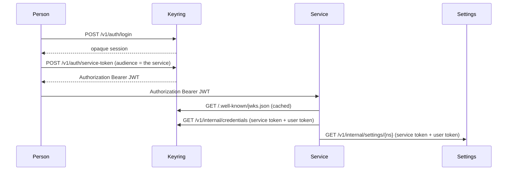
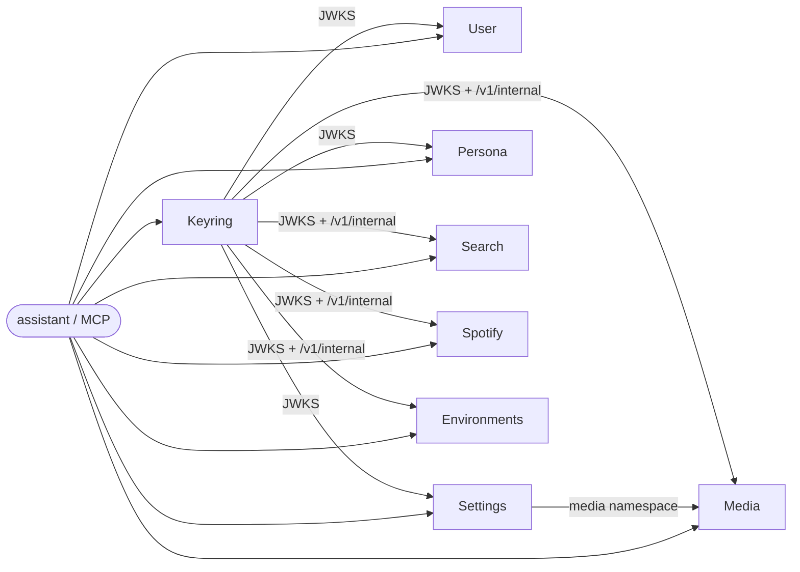

# LUCY-assistant

Eight HTTP services that together are the assistant's body: who the person is, who the
assistant is, how they want to be treated, what they have connected, and the tools that
act for them. This repository is the **family meta-repo**. It is not a monorepo. Each
service is its own git repository, cloned beside this file by `scripts/bootstrap.sh`.

`make check` is the same four gates everywhere it exists: lint, types, imports, tests at
100% branch coverage. `python scripts/parity.py` is how we notice when a checkout has
drifted.

The family can be private. Sign in once to GitHub; bootstrap, dependency installation,
and local image builds use that account. CI uses a separate read-only repository secret.

## Services

| Service | Purpose | Port | Env prefix | Health |
| --- | --- | ---: | --- | --- |
| [Keyring-api](https://github.com/tochi-mba/Keyring-api) | Accounts, profiles, and the credential vault. Issues the tokens everyone else verifies. | 8001 | `KEYRING_` | `/healthy`, `/ready` |
| [User-api](https://github.com/tochi-mba/User-api) | Structured facts about the **person** the assistant is talking to. | 8002 | `USER_API_` | `/healthy`, `/ready` |
| [Settings-api](https://github.com/tochi-mba/Settings-api) | Per-person knobs that used to live as process-wide env vars. | 8003 | `SETTINGS_API_` | `/healthy`, `/ready` |
| [Persona-api](https://github.com/tochi-mba/Persona-api) | The assistant's model of **itself** (fields and notes, one persona per profile). | 8004 | `PERSONA_` | `/healthy`, `/ready` |
| [Media-tool](https://github.com/tochi-mba/Media-tool) | Headless Chromium that clicks downloads; jobs and artifacts per account. | 8005 | `MEDIA_TOOL_` | `/healthy`, `/ready` |
| [Web-search-api](https://github.com/tochi-mba/Web-search-api) | Search, scrape, and summarise with a provider resolved per caller. | 8006 | `WSA_` | `/healthy` (alias `/health`), `/ready` |
| [Spotify-api](https://github.com/tochi-mba/Spotify-api) | Batch track lookup and confirmed playback. Holds no Spotify credential. | 8007 | `SPOTIFY_API_` | `/healthy`, `/ready` |
| [Environments-api](https://github.com/tochi-mba/Environments-api) | Sandboxed shells. Remote code execution as a product; needs Linux. | 8008 | `ENVAPI_` | `/healthy` (alias `/health`), `/ready` (alias `/health/ready`) |

Every service listens on its assigned port, so all eight run on one host without a
collision, and compose maps each host port to the same number inside the container.

**`/healthy` is liveness and `/ready` is readiness**, everywhere. Liveness does no I/O and
never fails, because an orchestrator restarts a container whose liveness check fails and
restarting a process does not fix the service it depends on. Readiness reports each
dependency and answers 503 when one is unusable. Point container healthchecks at the first
and load balancers at the second.

## Token flow

A person logs into keyring and holds an **opaque session**. Anything that acts for them
asks keyring to mint a short-lived **Bearer JWT** for a named audience, then presents
that token to the service. The service verifies it locally against keyring's JWKS. If it
needs a third-party credential, it calls keyring's `/v1/internal` with its own service
token *and* the user's token. If it needs a per-person knob, it calls settings-api the
same way.



Authorization is **Bearer**, everywhere. No `X-API-Key` as the identity of a person.
(A couple of services still accept an optional network-level API key on top; that is
not who the request is *for*.)

## Who calls whom



User-api, Persona-api, and Settings-api never call keyring at request time except to
fetch public keys. They have **no** entry in `KEYRING_SERVICE_TOKENS`. Media-tool,
Spotify-api, Web-search-api, and Environments-api do: they resolve credentials per
request. Media-tool is currently the only consumer with `MEDIA_TOOL_SETTINGS_API_*`
wired; settings-api already has grants for the rest.

Nothing in this family calls User, Persona, Media, Search, Spotify, or Environments
except the assistant sitting in front.

## Your first hour

1. Open this folder in a [devcontainer](.devcontainer/devcontainer.json) or on
   Linux/macOS/WSL2. Native Windows without WSL2 can run most services; Environments-api
   cannot.
2. `bash scripts/bootstrap.sh` or `pwsh scripts/bootstrap.ps1`. That checks for `uv`,
   Python 3.11/3.12, `make`, `git`, `gh`, `jq`, `sqlite3`, reports Docker without
   installing it, asks you to sign in to GitHub (browser or a pasted token) if you are
   not already, clones any missing checkout your account can read from `repos.txt`, and runs
   `make install` unless you pass `--no-install`.
3. In Keyring-api: copy `.env.example`, set `KEYRING_MASTER_KEY`, `make run`.
4. Mint a service token for the service you are working on
   (`POST /v1/auth/service-token` with that service's audience) and put the Bearer on
   the request.
5. `make check` in that repository. `python scripts/parity.py --repo <name>` from here
   if you want the family scoreboard.

To run all eight with Docker Engine running:

```bash
python scripts/genenv.py          # writes .env.family; never prints the values
make images && make up           # host ports 8001–8008; up reuses the build cache
```

Re-running `genenv.py` refuses to overwrite `.env.family` unless you pass `--force`.

## Signing in to GitHub

```bash
gh auth status               # which account is active
gh auth login                # a browser window, or paste a token: gh asks which
bash scripts/bootstrap.sh    # signs you in if you skipped that, then clones
make images                  # local builds use the same sign-in
```

Bootstrap runs `gh auth login` when you are not signed in and a terminal is available,
then `gh auth setup-git`, so `git clone` and `uv`'s fetches of the client packages use
that account. A repository your account cannot see is reported and skipped; existing
checkouts are left alone. Without a terminal, set `GH_TOKEN`; the devcontainer forwards
yours and re-runs bootstrap when a terminal attaches.

CI cannot open a browser, so it has its own token: fine-grained, read-only, limited to
the family. Create it once and install it on all nine repositories with
`python scripts/share_github.py`, which checks that the token can read them and never
prints it. Never put a GitHub credential in `.env.family`, a Docker build argument, or a
committed file. [docs/private-repos.md](docs/private-repos.md) is the full walkthrough,
including the order for making the family private. On native Windows, run Make recipes
in Git Bash; bootstrap also has a PowerShell version.

## Adding a repository to the family

Append one line to `repos.txt`: `<folder> <https clone URL>`. Private and public
repositories use the same format. Re-run bootstrap to clone it with your account.
For the family checks, give the service this caller in `.github/workflows/ci.yml`:

```yaml
name: CI
on:
  push:
    branches: ["**"]
  pull_request:
  workflow_dispatch:
jobs:
  service:
    uses: tochi-mba/LUCY-assistant/.github/workflows/service.yml@v1
    secrets: inherit
```

Add the new repository to the CI token's repository list (GitHub → Settings → Developer
settings → Fine-grained tokens → the family token → Repository access) so Actions can
read it, then `python scripts/parity.py --repo <folder>`. Bootstrap discovery needs only
the manifest line; adding a running service to Compose or a folder to the IDE workspace
is a separate choice.

## Keeping your copy private / Forking

Copy all nine repositories under one owner, keeping their names and client tags.
GitHub forks inherit their network's visibility: a fork of a public repository cannot
be made private by itself. Use private standalone copies when the upstream is public,
or private forks when GitHub permits them. See [GitHub's fork rules](https://docs.github.com/en/pull-requests/reference/forks).

From your copy of this meta-repo, with the service checkouts present:

```bash
python scripts/retarget.py YOUR_OWNER --dry-run
python scripts/retarget.py YOUR_OWNER
# Run each printed `uv lock --directory ...` command, review and commit the lockfiles.
```

The script changes manifest clone URLs, CI callers, the meta parity checkout, and
tagged client source URLs. It preserves line endings and never edits `uv.lock` or git
remotes. `--ref REF` selects a workflow ref (default `v1`); `--keep-sources` retains
upstream client URLs when your account can still read them. Relock on a machine signed
in to the destination owner and push the resulting changes to your copies.

Sign in with `gh auth login` as the destination owner, create that owner's read-only
token and install it with `python scripts/share_github.py`. Publish the meta workflow's
`v1` tag and allow the private meta repository's Actions to be used by your other
repositories. The [sign-in and rollout guide](docs/private-repos.md) has the order.

## Links

| | |
| --- | --- |
| Family standard | [CONTRIBUTING.md](CONTRIBUTING.md) |
| Architecture | [docs/architecture.md](docs/architecture.md) |
| Security | [docs/security.md](docs/security.md) |
| CI caller | [docs/ci.md](docs/ci.md) |
| GitHub sign-in and private copies | [docs/private-repos.md](docs/private-repos.md) |
| ADRs | [docs/adr/README.md](docs/adr/README.md) |
| Parity checker | `python scripts/parity.py` |
| Shared clients | `Keyring-api/clients/python`, `Settings-api/clients/python` |

## Support matrix

| Platform | Services | Compose | Notes |
| --- | --- | --- | --- |
| Linux | All eight | Expected to work | Environments-api sandbox tiers need privileges / `unshare`. |
| macOS | Seven; Environments-api directory tier only | Expected to work | Namespace/user tiers are Linux. |
| Windows via WSL2 | Same as Linux | Expected to work | Preferred Windows path. |
| Windows via [devcontainer](.devcontainer/devcontainer.json) | Same as Linux | Expected to work | Docker-in-Docker plus Playwright libraries. |
| Native Windows | Seven | Requires Docker Desktop's Linux engine | Run Make recipes in Git Bash. Environments-api runs in Linux containers. |

`--check` on bootstrap marks Environments-api **needs Linux** when the host is not Linux,
rather than running a suite that cannot pass.
